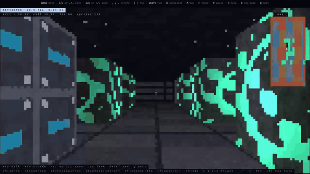
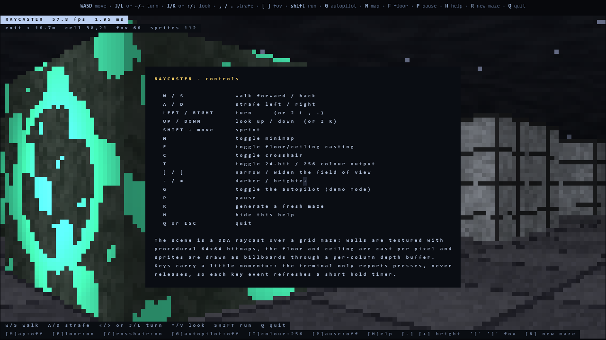

<div align="center">

# RAYCASTER

A Wolfenstein-3D style **raycasting engine written from scratch in C99** —
rendered with ANSI escape sequences in any terminal, and as WebAssembly on
any screen. No ncurses, no SDL, no image files: every texture is generated
procedurally at start-up and every frame is composited by hand.

[](https://911hash.github.io/raycaster/)
[](https://github.com/911hash/raycaster/actions/workflows/pages.yml)
[](LICENSE)
[](#how-it-works)
[](#how-it-works)



**[▶ play now in your browser](https://911hash.github.io/raycaster/)**
&nbsp;·&nbsp; or `./play.sh` in your terminal — one command, only a C compiler required.

</div>

## Quick start

```
./play.sh         # one command: builds (if needed) and plays
make run          # play
make demo         # watch the autopilot escape the maze
make test         # verify the engine (self test, 20 checks)
make bench        # off-screen frame benchmark
make dist         # package shareable archives into ./dist
make web          # build the browser version into ./web (needs emcc)
```

## Objective

Find the green **exit gate** in the outer wall and step through it to win.
The HUD shows a compass arrow and your distance to the gate, the minimap
marks it with a green `E`, and `G` lets the autopilot demonstrate the way
out.

## Controls

| key | action |
| --- | --- |
| `W` / `S` | walk forward / back |
| `A` / `D` | strafe left / right |
| `←` `→` (or `J` `L` `,` `.`) | turn |
| `↑` `↓` (or `I` `K`) | look up / down |
| `SHIFT` + move (capital letters) | sprint |
| `M` | minimap on/off |
| `F` | perspective floor/ceiling on/off |
| `C` | crosshair on/off |
| `T` | 24-bit ↔ xterm-256 colour |
| `[` `]` | field of view |
| `-` `=` | darker / brighter |
| `G` | autopilot (demo) on/off |
| `P` | pause |
| `R` | generate a new maze |
| `H` | help overlay |
| `Q` / `ESC` / `Ctrl-C` | quit (the terminal is always restored) |

## Command line

```
--size WxH     maze size, forced odd (default 31x31, max 63x63)
--seed N       maze seed
--fov DEG      horizontal field of view (default 66)
--fps N        render rate cap (default 60)
--frames N     stop after N frames
--headless     render off screen, print stats + an ASCII preview
--screen WxH   off-screen canvas size for --headless (default 100x40)
--demo         autopilot on at start
--no-floor     skip floor/ceiling casting (fastest)
--no-map       no minimap at start
--truecolor / --256   force a colour mode
--selftest     run the built-in verification and exit
--help         list everything
```

## How it works

* **Rays** — one DDA march per screen column over a grid of solid cells
  (`trace_ray`). The result is a hit cell, which wall face was crossed and the
  perpendicular distance to it.
* **Walls** — the distance selects the projected height `ph / dist`; the exact
  hit position along the wall picks the texture column, and a per-pixel step
  walks the texture vertically.
* **Floors and ceilings** — cast per pixel: for every row below the horizon the
  world distance is constant, so one division per row yields the world-space
  step between neighbouring pixels.
* **Sprites** — billboards transformed into camera space, sorted back to front
  and clipped column by column against the wall depth buffer, with a colour key
  for transparency and a pulsing emissive term for torches and orbs.
* **Lighting** — inverse-square-ish falloff, a fake directional term for
  Y-facing walls, a fog colour blend, and animated emissive "rune" walls.
* **Terminal output** — each character cell carries two colours and draws the
  UTF-8 *upper half block*, which doubles the vertical resolution. Colour
  escapes are only emitted when the quantised colour changes, the whole frame is
  assembled in a growable buffer and flushed with a single `write()`.
* **Maze** — recursive-backtracker generation, then braided (extra loops), with
  a pillared central hall, per-zone wall materials, a safe spawn search and
  scattered billboards.
* **Terminal control** — termios raw mode with `VMIN=0` for non-blocking reads,
  alternate screen, hidden cursor, `SIGWINCH`-driven resize, and terminal
  restore on exit *and* on `SIGINT`/`SIGTERM`/`SIGHUP`.

Keys only produce press events in a terminal (never releases), so each event
refreshes a short hold timer and the movement axis decays smoothly when the
events stop.

## Verification

```
$ ./raycaster --selftest
```

20 checks, including 381 pseudo-random rays traced through a hand-built world
and compared against an independent brute-force oracle (a 2 mm step walk plus a
bisection of the first wall crossing); plus projected wall height, ceiling/floor
shading, sprite placement, z-buffer occlusion and ANSI generation at absurd
canvas sizes; and end-to-end checks that every maze gets exactly one reachable
border exit and that the BFS autopilot escapes it within 120 s.

The WebAssembly build (`make webtest`) runs the same suite plus two checks on
the web export path (RGBA scene bytes and text-cell list), 22 in total.

`--headless` renders without a terminal and prints timing, framebuffer checksum
and a luminance preview, which makes the whole engine scriptable.

## Performance notes

Rendering is cheap (about 0.3–1.3 ms per frame at 100×40 … 200×50 cells); the
terminal itself is the bottleneck. If your terminal feels sluggish:

* press `T` (or use `--256`) — 256 colour frames are roughly 2.5× smaller;
* `--no-floor` or `--fps 30`;
* use a smaller window.

## Sharing

```
make dist
```

creates two archives in `dist/` — send either one anywhere (WhatsApp, Drive,
email, GitHub release):

* `raycaster-1.0-src.tar.gz` — for Linux/macOS (`tar -xzf` then `./play.sh`)
* `raycaster-1.0-src.zip` — same contents, friendlier for Windows/zip apps

The receiver only needs a terminal and a C compiler (gcc/clang) — `play.sh`
builds the game automatically, then it runs. If the unzip dropped the
executable bit, run `sh play.sh` instead. On Windows: install WSL and run
`wsl ./play.sh`.

## Play in a browser

**▶ live: https://911hash.github.io/raycaster/** — the exact bundle below,
hosted on GitHub Pages and rebuilt by CI on every push to `main`
(`.github/workflows/pages.yml`).

To build it yourself you need [Emscripten](https://emscripten.org) (`emcc`):

```sh
make web          # or: make web EMCC=/path/to/emcc
```

then open **`web/index.html`** (double-click works — the wasm is inlined into
a single `raycaster.js`, so `file://` is fine).



How it works: the renderer still builds the half-block cell framebuffer in C;
the web build exports it as a raw RGBA scene plus a list of text cells
(HUD/minimap/help), and a thin JavaScript layer paints both onto a canvas and
feeds key presses back into the same input parser as the terminal build —
`WASD`/`J L`/`I K`/arrows behave identically, holding a key auto-repeats like
terminal key repeat, and touch devices get on-screen d-pads.

* `make webtest` — runs the self test on the wasm build under node (22 checks)
* `make dist-web` — packages `dist/raycaster-1.0-web.zip` to share

## License

MIT — see [LICENSE](LICENSE).
